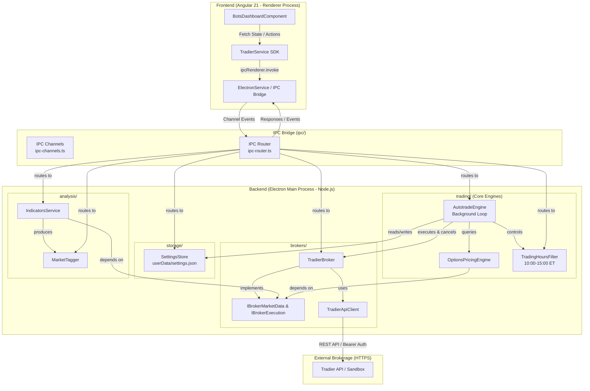

# OptionsApp Architecture & Design Approach

## Overview

**Purpose:** The primary purpose of this application is to facilitate automated trading by algorithmically evaluating market conditions in real-time.

The application is built on a modern **Desktop Application Architecture** utilizing the **Electron** framework. It follows a strict separation of concerns:

- **Backend (Main Process):** All heavy processing, mathematical computations, order execution, risk monitoring, and secure API requests are isolated in the Node.js Main Process, organized into modular domain packages.
- **Frontend (Renderer Process):** The Angular 21 Renderer Process is purely focused on visualization, live telemetry, and user interaction.
- **IPC Bridge:** Typed channel-based communication between backend and frontend, operating over internal Electron memory channels.
- **Native Desktop vs. Web Preview:** The application runs natively inside Electron where Node.js APIs, local disk persistence, and `.env` credentials exist. The browser port (`http://localhost:4200`) acts strictly as a disconnected UI development preview.

API keys are never exposed to the frontend browser context. Intensive algorithmic calculations and continuous background trading timers do not block the UI thread.

## Architecture Diagram



---

## Directory Structure

```
app/
├── main.ts                          # Electron window lifecycle & reloader
├── environment.ts                   # AppEnvironment type (sandbox vs production)
├── ipc/
│   ├── ipc-channels.ts              # Typed IPC channel constants
│   └── ipc-router.ts                # IPC handler registrations, service wiring & auto-resume
├── brokers/
│   ├── broker.interface.ts          # IBrokerMarketData + IBrokerExecution interfaces
│   ├── tradier/
│   │   ├── tradier-api-client.ts    # Low-level HTTP client (axios, rate limiting, auth)
│   │   └── tradier-broker.ts        # Implements market data & multileg order execution
│   └── index.ts
├── analysis/
│   ├── indicators-service.ts        # Technical indicator calculations (EMA, MACD, RSI, ADX)
│   ├── market-tagger.ts             # Market state evaluation flowchart logic
│   └── index.ts
├── trading/
│   ├── options-pricing-engine.ts    # Strike selection (delta) & limit price calculations
│   ├── trading-hours-filter.ts      # 10:00-15:00 ET time window gate
│   ├── autotrade-engine.ts          # Background evaluation loop, order TTL & circuit breaker
│   └── index.ts
├── storage/
│   └── settings-store.ts            # Persistent JSON store in userData/settings.json
└── test/
    ├── test-algo.ts                 # Indicators + tagger pipeline test
    └── test-pricer.ts               # Pricing engine test
```

---

## Execution Environments: Desktop Native vs. Web Preview

A core architectural invariant of Balaboost is the clear separation between the **Desktop Application** and the **Web Browser**:

| Capability | Desktop App (Electron) | Web Browser (`http://localhost:4200`) |
|------------|------------------------|---------------------------------------|
| **Runtime** | Node.js + Chromium | Standard Browser Sandbox |
| **Credentials** | Direct access to local `.env` | No access to local file system or `.env` |
| **IPC Bridge** | Fully connected via `ipcRenderer` | Disconnected (`window.require` is undefined) |
| **Autotrade Engine** | Runs continuous 30s background loops | Disconnected (UI-only preview) |
| **Order Placement & Cancels** | Live HTTPS requests to Tradier | Disabled / Mock fallback |
| **Disk Persistence** | Saved to OS `userData/settings.json` | Fallback to browser `localStorage` |
| **Status Badge** | `🖥️ Desktop Engine Connected` | `🌐 Web Browser Preview` |

---

## Core Subsystems

### 1. Broker Abstraction Layer (`brokers/`)

The `IBrokerMarketData` and `IBrokerExecution` interfaces decouple trading intelligence from any broker:
- `IndicatorsService` and `OptionsPricingEngine` depend strictly on interfaces, not on Tradier.
- **`TradierApiClient`**: Handles raw HTTP operations, dynamic environment routing (Sandbox vs. Production), and authentication.
- **`TradierBroker`**: Implements account balances, quote fetching, chain lookups, and multileg order placement / cancellation (`DELETE /accounts/{id}/orders/{id}`).

### 2. Analysis Engine (`analysis/`)

*   **`IndicatorsService` (The Math Engine)**
    *   Fetches 14 days of 15-minute OHLCV bars via `IBrokerMarketData.getTimesales()`.
    *   Maintains an in-memory 1-minute cache to prevent API rate-limiting.
    *   Computes EMA (8, 9, 20, 21, 100), MACD, RSI, CCI, Stochastic, and ADX using `technicalindicators`.
*   **`MarketTagger` (The Logic Engine)**
    *   Stateless evaluator running trend flowchart logic.
    *   Outputs descriptive market tags (e.g., `bull market`, `bear market`, `overbought market`).

### 3. Options Pricing Engine (`trading/options-pricing-engine.ts`)

*   Selects option spread strategies (Bull Put Spread / Bear Call Spread) based on tags.
*   **Hybrid Strike Selection with Maximum Width Cap**:
    *   Anchors the **Short Strike** to ~15Δ (~85% probability of profit).
    *   Targets ~10Δ for the **Long Strike**, but enforces a configurable `maxSpreadWidth` cap (default: 10–25 points).
    *   Prevents high-value index option skews (e.g. SPX at 7,700) from stretching into 100+ point spreads ($18,000+ collateral).
    *   Automatically falls back to the tightest available strike increment supported by the exchange board if requested width is tighter than chain spacing.
*   Calculates fair-value Mid Price from live order book bids/asks and adjusts aggressiveness by trend strength.

### 4. Automated Trading & Risk Management Engine (`trading/autotrade-engine.ts`)

The `AutotradeEngine` coordinates the full automated execution cycle:
*   **Order Timeout (TTL) & Collateral Protection (`checkAndCleanStaleOrders`)**:
    *   **Unconditional Step 1**: Runs before any entry gates or circuit breakers.
    *   Scans all working limit orders. If an order remains unfilled past `orderTimeoutMinutes` (default: 3m), it automatically cancels the multileg order on Tradier.
    *   Immediately unlocks frozen margin collateral (`pending_cash`) and returns it to `optionBuyingPower`.
*   **Daily Loss Circuit Breaker**:
    *   Tracks realized intraday P&L. If daily losses cross `maxDailyLoss` (e.g., -$500), autotrading halts, timers stop, and state switches to `paused`.
*   **Trading Hours Filter (`trading-hours-filter.ts`)**:
    *   Enforces a strict 10:00–15:00 ET execution window for *new* trade entries to avoid market-open whip and end-of-day spreads.
*   **Cooldown Buffer**:
    *   Enforces a configurable rest period (default: 15m) between filled trades.

### 5. Disk Settings Persistence (`storage/settings-store.ts`)

*   Persists risk presets, trading hours, UI preferences, and `autotradeActive` run state to `userData/settings.json`.
*   **Auto-Resume on Launch**: On desktop boot, `ipc-router.ts` checks `storedSettings.autoResumeOnLaunch`. If previously active, it automatically restarts the engine without user intervention.

### 6. The Angular Frontend (Renderer Process)

The frontend architecture uses Angular 21 Standalone Components organized under a modular Container / Presenter pattern:

#### 6.1 Domain Models & Pure Utilities
- **`src/app/core/models/options-trading.model.ts`**: Strongly typed domain models for OCC option symbology, `TradierOrder`, `TradierOrderLeg`, `TradierAccountBalance`, `TradeRecommendation`, `TradingHoursConfig`, `TradingHoursStatus`, and `ActiveBarValues`.
- **`src/app/core/utils/options-math.util.ts`**: Pure, deterministic, JSDoc-documented financial math functions and OCC parsers:
  - `parseOccOptionSymbol()` & `formatOccOptionSymbol()`: Translates standard 21-character OCC strings (e.g. `SPXW261102P07425000`) into human-readable labels.
  - `getSpreadCountFromOrder()`: Accounts for Tradier's 2-leg order quantity counting quirks (where 2 represents 1 spread unit).
  - `calculateOrderSpreadWidth()`: Computes point width between short and long strikes.
  - `calculateMaxCollateralHeld()`: Margin requirement formula: $(\text{Spread Width} - \text{Credit}) \times \text{Contracts} \times 100$.
  - `calculateExpectedProfit()`: Target profit formula: $\text{Credit} \times \text{Contracts} \times 100 \times (\text{Profit Target } \% / 100)$.
  - `calculateBuyToCloseDebit()`: Inverse debit limit price for exiting credit spreads: $(100\% - \text{Target } \%) \times \text{Original Credit}$.
  - `calculateReturnOnCapital()`: Computes Return on Capital (ROC) percentage: $(\text{Expected Profit} / \text{Collateral Held}) \times 100$.

#### 6.2 Modular Standalone Component Decomposition
Under `src/app/features/bots/bots-dashboard/components/`:
- **`BotsDashboardComponent` (Master Orchestrator)**: Coordinates real-time data polling, IPC communication, account buying power, and state flow.
- **`MarketChartComponent`**: Encapsulates TradingView Lightweight Charts, rendering daily candlesticks, 8 EMA and 21 EMA curves, and high-precision crosshair hover tracking.
- **`TradeRecommendationCardComponent`**: Displays algorithmic strategy tags, strike geometry, hybrid spread cap status, financial collateral estimates, and provides one-click paper order execution.
- **`OrdersListComponent`**: Categorized working and historical order cards with OCC symbol formatting, multileg collateral metrics, quick cancellation, and view filters (`All`, `Pending`, `Filled`, `Canceled / Rejected`).
- **`ClosePositionModalComponent`**: Interactive reversal spread exit dialog supporting user-customizable debit limit prices and market orders.
- **`RiskLimitsDrawerComponent`**: Slide-out drawer for configuring circuit breaker boundaries, position sizing, cooldown buffers, order TTL, and hybrid spread caps with 1-click strategy presets (`Conservative`, `Balanced`, `Aggressive`).
- **`TradingHoursDrawerComponent`**: Schedule management drawer for enforcing the 10:00–15:00 ET execution window and managing the Sandbox 24/7 testing bypass.
- **`AutotradeTerminalComponent`**: Monospace real-time event log feed tracking scan decisions, signal detections, and execution state changes.
