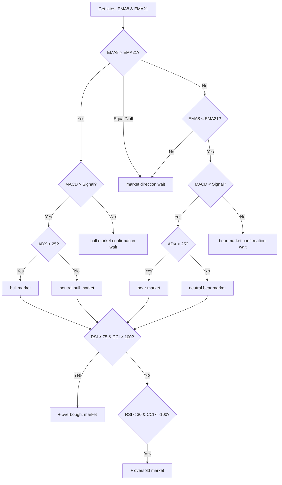
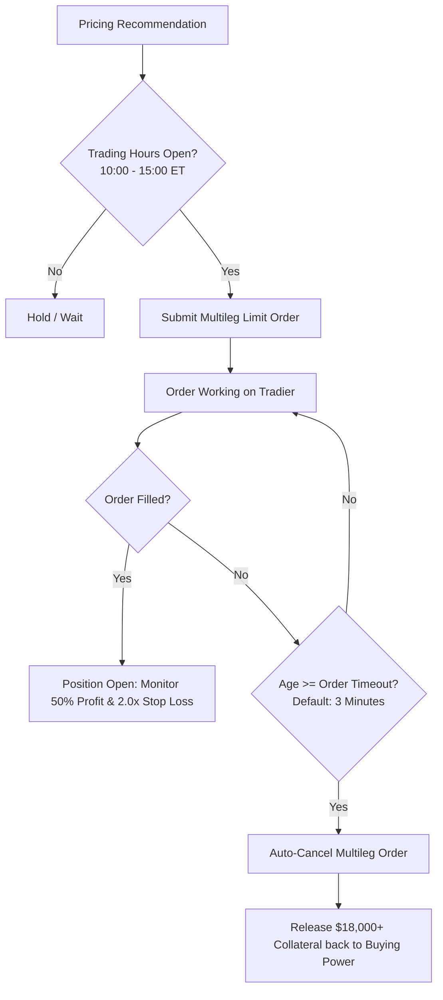

# Options Pricing Engine — Detailed Walkthrough

The Options Pricing Engine is the core trading intelligence of Balaboost. It takes raw market data, computes technical indicators, evaluates market conditions, and produces a fully specified options spread trade recommendation with a calculated limit price.

## Pipeline Overview

The full pipeline runs across three modules in sequence:

```
IndicatorsService → MarketTagger → OptionsPricingEngine
     (math)           (logic)         (trading)
```

| Step | Module | File | Responsibility |
|------|--------|------|---------------|
| 1 | `IndicatorsService` | [`app/analysis/indicators-service.ts`](file:///Users/felix/Desktop/ElectronProjects/OptionsApp/app/analysis/indicators-service.ts) | Fetch 15-min OHLCV bars, compute technical indicators |
| 2 | `MarketTagger` | [`app/analysis/market-tagger.ts`](file:///Users/felix/Desktop/ElectronProjects/OptionsApp/app/analysis/market-tagger.ts) | Evaluate indicators into descriptive market tags |
| 3 | `OptionsPricingEngine` | [`app/trading/options-pricing-engine.ts`](file:///Users/felix/Desktop/ElectronProjects/OptionsApp/app/trading/options-pricing-engine.ts) | Select strategy, pick strikes, calculate limit price |

All three depend on `IBrokerMarketData` ([`app/brokers/broker.interface.ts`](file:///Users/felix/Desktop/ElectronProjects/OptionsApp/app/brokers/broker.interface.ts)) for market data, not on any specific broker.

---

## Step 1: Technical Indicators (`IndicatorsService`)

**Location:** [`app/analysis/indicators-service.ts`](file:///Users/felix/Desktop/ElectronProjects/OptionsApp/app/analysis/indicators-service.ts)

Fetches 14 days of 15-minute OHLCV bars via `IBrokerMarketData.getTimesales()` and computes:

| Indicator | Parameters | Purpose |
|-----------|-----------|---------|
| EMA 8 | period: 8 | Fast trend line |
| EMA 21 | period: 21 | Slow trend line |
| EMA 9, 20, 100 | various | Additional trend context |
| MACD | fast: 12, slow: 26, signal: 9 | Trend confirmation |
| RSI | period: 14 | Momentum / overbought-oversold |
| CCI | period: 14 | Momentum confirmation |
| Stochastic | period: 5, signal: 3 | Mean-reversion signals |
| ADX | period: 14 | Trend strength measurement |

Results are cached for 1 minute to prevent rate-limiting.

---

## Step 2: Market Tagging Algorithm (`MarketTagger`)

**Location:** [`app/analysis/market-tagger.ts`](file:///Users/felix/Desktop/ElectronProjects/OptionsApp/app/analysis/market-tagger.ts)

A stateless evaluator that takes the computed indicators and produces a set of descriptive tags. The algorithm is a multi-step flowchart:

### Step 2a: Base Trend Direction
Compares the latest EMA 8 vs EMA 21 values:
- **EMA 8 > EMA 21** → Bullish trend
- **EMA 8 < EMA 21** → Bearish trend
- **Equal / null** → `market direction wait` (no trade)

### Step 2b: MACD Confirmation
The trend must be confirmed by MACD alignment:
- Bullish trend + **MACD > Signal line** → Confirmed bullish
- Bullish trend + **MACD ≤ Signal line** → `bull market confirmation wait` (no trade)
- Bearish trend + **MACD < Signal line** → Confirmed bearish
- Bearish trend + **MACD ≥ Signal line** → `bear market confirmation wait` (no trade)

### Step 2c: Trend Strength (ADX)
If the trend is MACD-confirmed, ADX determines strength:
- **ADX > 25** → Strong trend → `bull market` or `bear market`
- **ADX ≤ 25** → Weak trend → `neutral bull market` or `neutral bear market`

### Step 2d: EMA Crossover Detection
Checks if EMA 8 crossed EMA 21 within the last 2 bars:
- Crossed above → adds `8ema above 21ema`
- Crossed below → adds `8ema under 21ema`

### Step 2e: Extreme Conditions
- **RSI > 75 AND CCI > 100** → `overbought market`
- **RSI < 30 AND CCI < −100** → `oversold market`

### Decision Flowchart



### All Possible Tags

| Tag | Meaning | Triggers Trade? |
|-----|---------|----------------|
| `bull market` | Strong confirmed uptrend | ✅ Bull Put Spread |
| `neutral bull market` | Weak confirmed uptrend | ✅ Bull Put Spread |
| `bear market` | Strong confirmed downtrend | ✅ Bear Call Spread |
| `neutral bear market` | Weak confirmed downtrend | ✅ Bear Call Spread |
| `bull market confirmation wait` | Bullish EMA but MACD disagrees | ❌ Halt |
| `bear market confirmation wait` | Bearish EMA but MACD disagrees | ❌ Halt |
| `market direction wait` | No clear direction | ❌ Halt |
| `8ema above 21ema` | Recent bullish crossover | Informational |
| `8ema under 21ema` | Recent bearish crossover | Informational |
| `overbought market` | RSI + CCI both extreme high | Affects limit price |
| `oversold market` | RSI + CCI both extreme low | Affects limit price |

---

## Step 3: Options Pricing Engine (`OptionsPricingEngine`)

**Location:** [`app/trading/options-pricing-engine.ts`](file:///Users/felix/Desktop/ElectronProjects/OptionsApp/app/trading/options-pricing-engine.ts)

Takes the `MarketTag[]` from the tagger and produces a fully specified trade ticket.

### Step 3a: Strategy Selection
| Tags present | Strategy |
|-------------|----------|
| `bull market` or `neutral bull market` | **Bull Put Spread** (sell put, buy lower put) |
| `bear market` or `neutral bear market` | **Bear Call Spread** (sell call, buy higher call) |
| Any `wait` tag or no trend tag | **Halt** — no trade recommended |

### Step 3b: Expiration Selection
Queries all available expirations via `broker.getExpirations()` and picks the first one that is **25–45 days** out (targeting ~30 DTE). Falls back to the nearest available expiration.

### Step 3c: Strike Selection (Hybrid Delta with Maximum Width Cap)
Fetches the full options chain with Greeks via `broker.getOptionsChain()`, then:

| Leg | Target Selection | Role & Safeguard |
|---|---|---|
| **Short leg** | ~0.15 (15Δ) | ~85% statistical probability of expiring OTM |
| **Long leg** | ~0.10 (10Δ) **Capped at `maxSpreadWidth`** | Safeguards capital from index skew explosion |

#### The Hybrid Safeguard Mechanism:
1. **Target Delta (10Δ)**: The engine searches for the protective wing closest to 0.10 delta.
2. **Maximum Spread Width Cap (`maxSpreadWidth`, default 10–25 pts)**:
   - On lower-priced underlyings (e.g. SPY at $580), a 10Δ wing sits 3–5 points away $\rightarrow$ the natural 10Δ strike is used.
   - On high-value indices (e.g. SPX at 7,700), a 10Δ wing can sit 100+ points away, which would lock up \$18,000+ in collateral!
   - The engine automatically clamps the long wing to the `maxSpreadWidth` boundary (or the tightest available strike permitted by exchange strike spacing), containing collateral to predictable, manageable risk budgets (e.g., \$500–\$2,500).
   - If clamped, the ticket sets `capApplied: true` and displays a `🛡️ [Width]pt Cap` badge in the UI.

### Step 3d: Fair Value Calculation
For each leg, calculates the **mid price** (average of bid and ask):
```
shortMid = (shortLeg.bid + shortLeg.ask) / 2
longMid  = (longLeg.bid + longLeg.ask) / 2
netCreditMid = shortMid - longMid
```

### Step 3e: Limit Price Adjustment (Tag-Based Aggressiveness)

| Market Condition | Adjustment | Reasoning |
|-----------------|------------|-----------|
| `bull market` or `bear market` (strong trend) | `midPrice × 0.95` (give up 5%) | Prioritize fast fill in strong trends |
| `overbought market` or `oversold market` | `midPrice × 1.10` (demand 10% more) | Contrarian premium — market may reverse |
| Otherwise (neutral trends) | `midPrice × 1.00` (no adjustment) | Fair-value fill |

---

## Verification

A live test using the Tradier API on SPX produced this output:

```json
{
  "action": "Trade",
  "strategy": "Bull Put Spread",
  "expiration": "2026-09-18",
  "underlyingPrice": 7674.37,
  "shortLeg": {
    "strike": 7655,
    "bid": 88.9,
    "ask": 90.3,
    "mid": "89.60"
  },
  "longLeg": {
    "strike": 7650,
    "bid": 87.1,
    "ask": 88.4,
    "mid": "87.75"
  },
  "netCreditMid": "1.85",
  "recommendedLimitPrice": "1.76",
  "aggressiveness": "Aggressive (Strong Trend)",
  "tagsUsed": [
    "bull market"
  ]
}
```

---

---

## Step 4: Automated Execution & Order Lifecycle Management

Once the `OptionsPricingEngine` produces a trade recommendation, the **`AutotradeEngine`** ([`app/trading/autotrade-engine.ts`](file:///Users/felix/Desktop/ElectronProjects/OptionsApp/app/trading/autotrade-engine.ts)) manages order submission, working order monitoring, and risk containment.



### 1. Order Timeout (TTL) & Collateral Protection
* **The Problem Solved:** Limit orders placed when the index is at one price can be left behind if the market moves quickly away. In options spreads, working limit orders freeze significant margin collateral (`pending_cash: $18,423.70` for a 4-contract 5-wide spread).
* **The Solution:** The engine inspects all pending limit orders on every cycle. If an order has been working longer than `orderTimeoutMinutes` (default: **3 minutes**, user-configurable from 1 to 30 min):
  1. The engine automatically issues `TradierBroker.cancelOrder(orderId)`.
  2. Tradier cancels both legs of the spread.
  3. The margin collateral is immediately unfrozen and returned to `optionBuyingPower`.
  4. The event is recorded in the activity feed: `⏱️ Stale Order Detected: #39733548 timed out after 3.1m. Auto-cancelling to release buying power.`

### 2. Profit Target & Stop-Loss Discipline
* **50% Take-Profit Target:** When an open credit spread's buyback debit drops to 50% of the initial credit collected, the position can be closed to lock in profit.
* **Stop-Loss Multiplier:** Protects capital by triggering an exit if the buyback cost expands to $2.0\times$ the initial credit.
* **Circuit Breaker:** If cumulative realized daily losses reach the configured ceiling (e.g., -$500), all autotrading immediately halts and switches to `paused`.

---

## IPC Integration

The engine, risk controls, and execution pipeline are wired into the app via the following IPC channels (registered in [`app/ipc/ipc-router.ts`](file:///Users/felix/Desktop/ElectronProjects/OptionsApp/app/ipc/ipc-router.ts)):

| Channel | Method | Description |
| :--- | :--- | :--- |
| `trading:previewOrder` | `calculateLimitPrice()` | Runs the full pipeline: indicators → tags → strike selection & limit price. |
| `trading:placeOrder` | `placeSpreadOrder()` | Submits a multi-leg options spread order to Tradier Sandbox (`/accounts/{id}/orders`). |
| `trading:getOrders` | `getOrders()` | Fetches active working, filled, and canceled orders from Tradier Sandbox, while auto-cleaning stale orders. |
| `trading:cancelOrder` | `cancelOrder()` | Cancels an open or pending order in Tradier Sandbox. |
| `trading:closePosition` | `closeSpreadPosition()` | Submits a closing multileg debit order to capture profit or stop losses. |
| `trading:getBalance` | `getAccountBalance()` | Retrieves live buying power and equity from Tradier. |
| `trading:getHoursStatus` | `getHoursStatus()` | Queries current market clock, trading window gates, and remaining time. |
| `trading:setHoursConfig` | `setHoursConfig()` | Configures active trading hours (e.g. 10:00 to 15:00 ET). |
| `autotrade:getState` | `getState()` | Queries running state, circuit breaker status, active metrics, and logs. |
| `autotrade:start` | `start()` | Activates continuous 30s scanning loop and persists run state. |
| `autotrade:pause` | `pause()` | Temporarily suspends automated executions without resetting metrics. |
| `autotrade:stop` | `stop()` | Stops scanning loop and persists inactive state. |
| `autotrade:scanNow` | `triggerScan()` | Forces an immediate manual scan and pending order maintenance cycle. |

Results and active orders are displayed in real-time in the **Options Trading Engine** dashboard.

---

## Roadmap & Future Enhancements

1. **Multi-Timeframe Analysis:** Use Daily or 1-Hour candles for macro trend direction (Bull vs Bear filter), and use 15-Minute candles for precise entry timing (MACD crossover confirmation).
2. **Automated Stop-Loss Execution:** Automatically fire closing debit orders when buyback price crosses the stop-loss multiple without requiring manual confirmation in the Close modal.
3. **Automated Vanguard Execution:** Connect trade recommendations to automated browser execution if supported.


